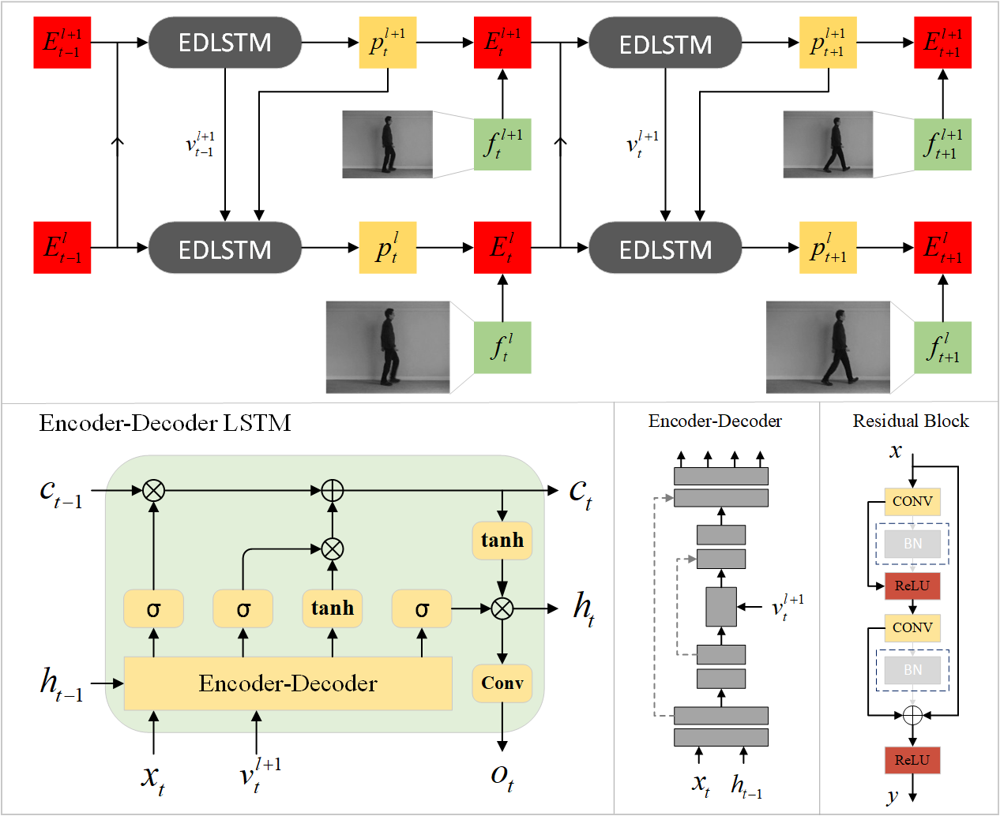
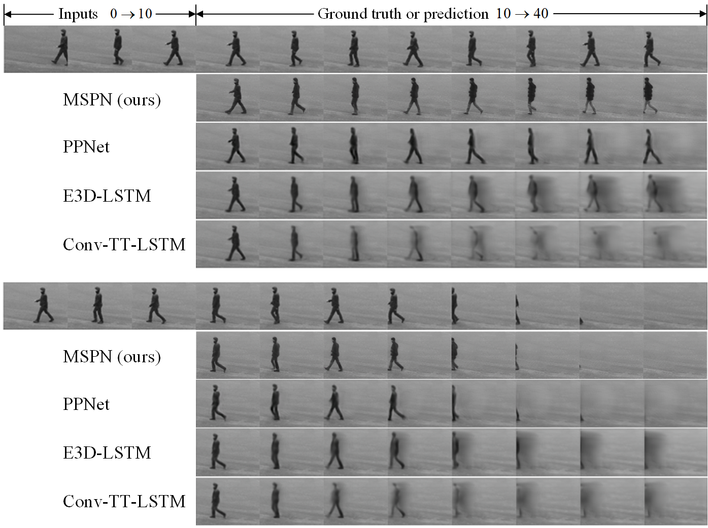

# Predictive Coding Based Multi-scale Predictive Network for Video Prediction  
[ArXiv paper is available here](http://arxiv.org/abs/2212.11642)  

 
 
We are introducing a multi-scale predictive model for video prediction here, whose design is inspired by the "Predictive Coding" theories and "Coarse to Fine" approach. As a predictive coding model, it is updated by a combination of bottom-up and top-down information flows, which is different from traditional bottom-up training style. Its advantage is to reduce the dependence on input information and improve its ability to predict and generate images. Importantly, we achieve with a multi-scale approach---higher level neurons generate coarser predictions (lower resolution), while the lower level generate finer predictions (higher resolution). This is different from the traditional predictive coding framework in which higher level predict the activity of neurons in lower level. To improve the predictive ability, we integrate an encoder-decoder network in the LSTM architecture and share the final encoded high-level semantic information between different levels. Additionally, since the output of each network level is an RGB image, a smaller LSTM hidden state can be used to retain and update the only necessary hidden information, avoiding being mapped to an overly discrete and complex space. In this way, we can reduce the difficulty of prediction and the computational overhead. Finally, we further explore the training strategies, to address the instability in adversarial training and mismatch between training and testing in long-term prediction.

### Dependencies
* PyTorch, version 1.12.1 or above
* opencv, version 4.6.0 or above
* numpy, version 1.23.4 or above
* skimage, version 0.19.3 or above
* lpips

Please download and process the relevant datasets first. In order to save time, we process the video sequence into data of size (T, C, H, W) in advance, where T represents the length of the sequence, and C, H, W represent the dimension, height and width of the image respectively. We have provided examples for pre-processing of each dataset in this project. In addition, it is recommended to create new folders named "models" and "metric" in the local project to save the training model and evaluation results. Or, you can save it to other paths, but you need to modify the save path specified in the program.

### Model Implementation
* NetBlock.py, implementation of the basic encoder-decoder network
* ConvLSTM_Module.py, implementation of the encoder-decoder LSTM unit
* MSPN.py, implementation of the complete multi-scale predictive network

### Training and Testing
* pix_train.py, using only pixel-level loss (Euclidene distance) for training
* adv_train.py, using the improved adversarial training method proposed in this paper for training
* test.py, for testing

### Others
* Discriminator.py, the discriminator network constructed with conventional residual block
* utils.py, construction of PyTorch dataset and calculation of loss, etc

